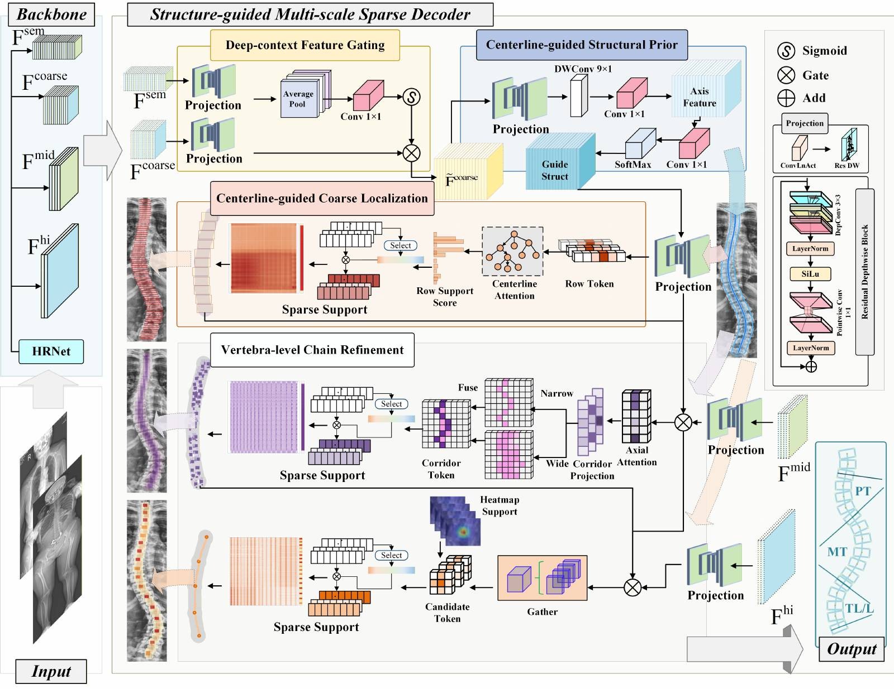

# Structure-Guided Sparse Attention for Vertebral Point Detection in Scoliosis Radiographs

This repository provides the inference and evaluation code for our structure-guided sparse attention framework for vertebral point detection in scoliosis radiographs.

## Abstract

Accurate Cobb angle measurement is fundamental to scoliosis assessment and follow-up. However, standing radiographs acquired in clinical practice often retain broad anatomical coverage from the skull and shoulders to the pelvis and lower limbs. Non-spinal osseous structures may consequently produce local responses similar to those of vertebrae, destabilizing vertebral localization and subsequent angle computation. A structured multiscale sparse decoding framework is proposed for vertebral localization and Cobb angle measurement in scoliosis radiographs. The framework uses vertebral point detection as its geometric output form, introduces a centerline-guided continuous spinal-structure reference during feature decoding, and constructs multiscale vertebra-level structural features. Spinal arrangement context is combined with high-resolution local geometry to predict vertebral centers, center offsets, and corner offsets. By interpreting local osseous responses within the continuous spinal structure, the framework improves the recognition stability of vertebral structural units. The proposed method achieves 6.09\% SMAPE and 1.54$^\circ$ MAE on the AASCE test set, and 5.92\% overall SMAPE, 2.07$^\circ$ overall MAE, and 4.19~px 68-corner Point ED on the Clinical-150 external clinical test set, demonstrating stable vertebral point localization and Cobb angle measurement.

## Framework



Structured multiscale sparse decoding framework. The model combines deep-context feature gating, centerline-guided structural prior learning, centerline-guided coarse localization, vertebra-level chain refinement, and high-resolution candidate gathering before decoding vertebral points and Cobb-related geometry.

## Pretrained Checkpoints

Pretrained checkpoints are provided through Baidu Netdisk:

- Link: `https://pan.baidu.com/s/1YiB3rLv7D9xU9-d4tkRkAQ?pwd=wxtr`
- Password: `wxtr`

The shared package contains two checkpoint folders:

| Paper setting | Checkpoint folder | Checkpoint path |
| --- | --- | --- |
| `AASCE-98` | `fh_data_bs` | `weights/fh_data_bs/latest_model.pth` |
| `Clinical-150` | `fh_data_lc` | `weights/fh_data_lc/latest_model.pth` |

In other words, the `fh_data_bs` checkpoint corresponds to the `AASCE-98` setting reported in the paper, while the `fh_data_lc` checkpoint corresponds to the `Clinical-150` setting.

After downloading, place the files in the repository as:

```text
weights/
  fh_data_bs/
    latest_model.pth
  fh_data_lc/
    latest_model.pth
```

## Repository Structure

```text
datasets/     dataset loaders
models/       network definition
operation/    decoding and preprocessing utilities
weights/      pretrained checkpoints (download separately)
outputs/      prediction and evaluation outputs
main.py       entry point for inference and evaluation
```

## Installation

```bash
pip install -r requirements.txt
```

## Inference

Run prediction on a folder of radiographs:

```bash
python main.py ^
  --phase predict ^
  --image_dir ../data/fh_data_bs/test/images ^
  --checkpoint weights/fh_data_bs/latest_model.pth ^
  --output_dir outputs/predict_bs
```

Main output files:

- `predictions.csv`: predicted vertebral landmark coordinates in original-image space
- `summary.json`: run summary

## Evaluation

Run evaluation on a labeled split:

```bash
python main.py ^
  --phase eval ^
  --data_dir ../data/fh_data_bs ^
  --split test ^
  --checkpoint weights/fh_data_bs/latest_model.pth ^
  --output_dir outputs/eval_bs_test
```

Main output files:

- `angles.csv`: predicted and reference Cobb angles
- `predictions.csv`: predicted and reference landmark coordinates
- `point_errors.csv`: vertebral localization errors
- `summary.json`: aggregate evaluation results

## Expected Data Layout

```text
data_root/
  train/
    images/
    labels/
  val/
    images/
    labels/
  test/
    images/
    labels/
```

Each label file should correspond to one image and store vertebral landmark points in `.mat` format.
