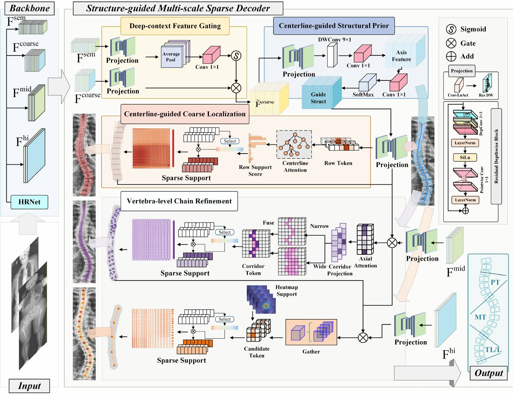

# Structured Multiscale Sparse Decoding for Vertebral Point Detection in Scoliosis Radiographs

This repository provides the training, validation, inference, and held-out test evaluation code for our structured multiscale sparse decoding framework for vertebral point detection in scoliosis radiographs.

## Contents

- [Abstract](#abstract)
- [Framework](#framework)
- [Method-to-Code Map](#method-to-code-map)
- [Train, Validation, and Test Separation](#train-validation-and-test-separation)
- [Trained SMSD Checkpoints](#trained-smsd-checkpoints)
- [Repository Structure](#repository-structure)
- [Installation](#installation)
- [Training with Validation](#training-with-validation)
- [Inference](#inference)
- [Evaluation](#evaluation)
- [AASCE-98 Test Annotations](#aasce-98-test-annotations)
- [Expected Data Layout](#expected-data-layout)
- [Supplementary Appendix](#supplementary-appendix)
  - [Appendix A. Decoder Implementation](#appendix-a-decoder-implementation)
    - [A.1. Semantic modulation](#a1-semantic-modulation)
    - [A.2. Structural support and row selection](#a2-structural-support-and-row-selection)
    - [A.3. Corridor aggregation and longitudinal attention](#a3-corridor-aggregation-and-longitudinal-attention)
    - [A.4. Multiscale feature fusion](#a4-multiscale-feature-fusion)
    - [A.5. Loss weights](#a5-loss-weights)
  - [Appendix B. Landmark Decoding and Cobb-Angle Computation](#appendix-b-landmark-decoding-and-cobb-angle-computation)
    - [B.1. Landmark decoding](#b1-landmark-decoding)
    - [B.2. Cobb-angle computation](#b2-cobb-angle-computation)
  - [Appendix C. Training Settings](#appendix-c-training-settings)
- [Compared Methods and GitHub Repositories](#compared-methods-and-github-repositories)

## Abstract

Accurate Cobb angle measurement is fundamental to scoliosis assessment and follow-up. However, standing radiographs acquired in clinical practice often retain broad anatomical coverage from the skull and shoulders to the pelvis and lower limbs. Non-spinal osseous structures may consequently produce local responses similar to those of vertebrae, destabilizing vertebral localization and subsequent angle computation. A structured multiscale sparse decoding framework is proposed for vertebral localization and Cobb angle measurement in scoliosis radiographs. The framework uses vertebral point detection as its geometric output form, introduces a centerline-guided continuous spinal-structure reference during feature decoding, and constructs multiscale vertebra-level structural features. Spinal arrangement context is combined with high-resolution local geometry to predict vertebral centers, center offsets, and corner offsets. By interpreting local osseous responses within the continuous spinal structure, the framework improves the recognition stability of vertebral structural units. The proposed method achieves 6.09% SMAPE and 1.54 deg MAE on the AASCE test set, and 5.92% overall SMAPE, 2.07 deg overall MAE, and 4.19 px 68-corner Point ED on the Clinical-150 external clinical test set, demonstrating stable vertebral point localization and Cobb angle measurement.

## Framework



Structured multiscale sparse decoding framework. The model combines deep-context feature gating, centerline-guided structural prior learning, centerline-guided coarse localization, vertebra-level chain refinement, and high-resolution candidate gathering before decoding vertebral points and Cobb-related geometry.

## Method-to-Code Map

The paper presents the structural formulation of SMSD, while this repository records the implementation-level choices needed to reproduce the released pipeline.

| Method component | Main implementation |
| --- | --- |
| Multiscale backbone and decoder assembly | `models/DecNet.py`: `StructuredSpineDecoder` |
| Global semantic calibration | `models/DecNet.py`: `SemanticP5Bias` |
| Centerline parameterization and row-level structural propagation | `models/DecNet.py`: `ExplicitAxisRepresentation` |
| Narrow/wide centerline-aligned corridors and vertebral-chain reasoning | `models/DecNet.py`: `CanonicalStripContext` |
| High-resolution sparse candidate refinement | `models/DecNet.py`: `PeakOffsetRefiner` |
| Heatmap and offset decoding | `models/DecNet.py`, `operation/decode.py`, and `main.py` |
| Centerline and vertebral supervision targets | `datasets/dataset.py` |
| Training objectives | `operation/loss.py` |
| Training and validation loop | `operation/train.py` |

Decoder implementation, mathematical definitions, and configuration values are documented in [Appendix A](#appendix-a-decoder-implementation).

## Train, Validation, and Test Separation

The three data roles are explicit and disjoint in the public workflow:

- `--phase train` optimizes the model on `train/` and monitors convergence on `val/`. It never constructs or reads the `test/` dataset.
- `--phase eval` is reserved for final reporting and always reads `test/`.

For the final manuscript experiments, the checkpoint with the lowest total validation loss is selected for held-out test evaluation. The shared checkpoints are named `best_model.pth`. Test data are not used for checkpoint selection. The existing public training entry point still saves `latest_model.pth` and periodic checkpoints; it does not yet implement the manuscript's best-validation checkpoint selection.

## Trained SMSD Checkpoints

Trained SMSD checkpoints are provided through Baidu Netdisk:

- Link: `https://pan.baidu.com/s/1YiB3rLv7D9xU9-d4tkRkAQ?pwd=wxtr`
- Password: `wxtr`

The shared package contains two checkpoint folders:

| Paper setting | Checkpoint folder | Checkpoint path |
| --- | --- | --- |
| `AASCE-98` | `fh_data_bs` | `weights/fh_data_bs/best_model.pth` |
| `Clinical-150` | `fh_data_lc` | `weights/fh_data_lc/best_model.pth` |

In other words, the `fh_data_bs` checkpoint corresponds to the `AASCE-98` setting reported in the paper, while the `fh_data_lc` checkpoint corresponds to the `Clinical-150` setting.

After downloading, place the files in the repository as:

```text
weights/
  fh_data_bs/
    best_model.pth
  fh_data_lc/
    best_model.pth
```

The HRNet-W32 backbone initializer used for training is separate from these trained SMSD checkpoints. Place `faster_rcnn_hrnetv2p_w32_mstrain_syncbn_1x.pth` directly under `weights/`; the expected file has SHA-256 `33B9A18C6C93AF3ACD92939EFBBA4D705F7B035228BD183A43B9E6208DF2E424`. Its provenance is the Faster R-CNN HRNetV2p-W32, 1x, SyncBN, multi-scale COCO checkpoint from the [official HRNet object-detection model family](https://github.com/HRNet/HRNet-Object-Detection#faster-r-cnn). The loader imports only shape-compatible backbone tensors and reports the matched, missing, ignored, and mismatched keys.

## Repository Structure

```text
datasets/     split-aware dataset loaders and supervision targets
models/       network definition
operation/    training, loss, decoding, and preprocessing utilities
weights/      trained SMSD checkpoints and the HRNet initializer (download separately)
outputs/      prediction and evaluation outputs
check_splits.py  split-count and overlap audit
main.py       entry point for training, validation, inference, and test evaluation
```

## Installation

The reported software environment uses Python 3.10 and CUDA 11.8. A CUDA-enabled PyTorch build compatible with the local CUDA/runtime configuration is required for GPU training. Install the remaining Python dependencies with:

```bash
pip install -r requirements.txt
pip install Pillow
```

## Training with Validation

The manuscript training settings for Ours and all compared methods are listed in [Appendix C](#appendix-c-training-settings).

The dataset root must contain separate `train/`, `val/`, and `test/` directories. A basic command for the existing public training entry point is:

```bash
python main.py --phase train --data_dir ../data/aasce_98 --use_hrnet_pretrained --hrnet_pretrained weights/faster_rcnn_hrnetv2p_w32_mstrain_syncbn_1x.pth --checkpoint_dir weights/aasce_98 --output_dir outputs/train_aasce_98
```

This command uses the existing release defaults. It does not reproduce all final-manuscript training settings or best-validation checkpoint selection automatically. For inference and evaluation, use the supplied `best_model.pth` checkpoints below.

## Inference

Run prediction on a folder of radiographs:

```bash
python main.py ^
  --phase predict ^
  --image_dir ../data/aasce_98/test/images ^
  --checkpoint weights/fh_data_bs/best_model.pth ^
  --output_dir outputs/predict_aasce_98
```

Main output files:

- `predictions.csv`: predicted vertebral landmark coordinates in original-image space
- `summary.json`: run summary

Landmark decoding is specified in [Appendix B.1](#b1-landmark-decoding).

## Evaluation

After training is complete, run final evaluation on the held-out `test/` split:

```bash
python main.py ^
  --phase eval ^
  --data_dir ../data/aasce_98 ^
  --checkpoint weights/fh_data_bs/best_model.pth ^
  --output_dir outputs/eval_aasce_98_test
```

The `eval` command is restricted to `test/`; validation is performed only inside the training workflow.

Main output files:

- `angles.csv`: predicted and reference Cobb angles
- `predictions.csv`: predicted and reference landmark coordinates
- `point_errors.csv`: vertebral localization errors
- `summary.json`: aggregate evaluation results

The complete Cobb-angle computation is given in [Appendix B.2](#b2-cobb-angle-computation).

## AASCE-98 Test Annotations

The [AASCE-98 annotation release](annotations/AASCE-98/) provides 98 study-curated MAT files for the original AASCE challenge test images. Each file stores the 68 final vertebral corner coordinates in the original image coordinate system. Only annotations are distributed; images and visualizations are not included. See the release notes for point order, coordinate conventions, and annotation provenance.

## Expected Data Layout

Each paper setting uses its own dataset root and its own checkpoints:

```text
data/
  aasce_128/       # 431 train / 50 val / 128 test
    train/{images,labels}/
    val/{images,labels}/
    test/{images,labels}/
  aasce_98/        # 549 train / 60 val / 98 test
    train/{images,labels}/
    val/{images,labels}/
    test/{images,labels}/
  clinical_150/    # 637 train / 70 val / 150 test
    train/{images,labels}/
    val/{images,labels}/
    test/{images,labels}/
```

Before training or final evaluation, the paper-defined counts, label coverage, and pairwise split disjointness can be checked with:

```bash
python check_splits.py --data_dir ../data/aasce_128 --protocol aasce-128
python check_splits.py --data_dir ../data/aasce_98 --protocol aasce-98
python check_splits.py --data_dir ../data/clinical_150 --protocol clinical-150
```

The check fails if the observed counts differ from the selected protocol, if a label is missing, or if any image identifier or image content is shared across train, validation, and test.

Each label file should correspond to one image and store vertebral landmark points in `.mat` format.

## Supplementary Appendix

The full appendix below follows the final manuscript version dated September 18, 2026. Equations and tables are formatted for GitHub; the scientific content is retained.

The sections above provide basic usage instructions. The appendix below records the final manuscript implementation and experiment settings.

### Appendix A. Decoder Implementation

#### A.1. Semantic modulation

The backbone produces multiresolution features $F^{\mathrm{high}}$, $F^{\mathrm{mid}}$, and $F^{\mathrm{coarse}}$ and a semantic representation $F^{\mathrm{sem}}$. A residual depthwise block followed by a pointwise transform maps $F^{\mathrm{sem}}$ to $\widetilde F^{\mathrm{sem}}$. Global average pooling yields the context vector $v^{\mathrm{sem}}$ for coarse-feature modulation:

$$
\begin{aligned}
\widetilde F^{\mathrm{coarse}}
&=\Gamma\!\left(F^{\mathrm{coarse}},F^{\mathrm{sem}}\right)\\
&=F^{\mathrm{coarse}}\odot
\left(\alpha_{\mathrm{mod}}+\beta_{\mathrm{mod}}\,g(v^{\mathrm{sem}})\right).
\end{aligned}
$$

Two learned pointwise projections, with SiLU between them and a final sigmoid, produce the input-dependent channel gate $g(v^{\mathrm{sem}})$. The coefficients $\alpha_{\mathrm{mod}}$ and $\beta_{\mathrm{mod}}$ are the affine offset and scale, set to 0.70 and 0.60, respectively.

#### A.2. Structural support and row selection

For normalized horizontal coordinates $\bar x\in[-1,1]$, the predicted structural scale $s_y\in[0.035,0.24]$ determines the axial and band-support widths, indexed by $q\in\{\mathrm n,\mathrm w\}$:

$$
\sigma_y^q=\mathrm{clip}\!
\left(\alpha_\sigma^q s_y+\beta_\sigma^q,\,
\sigma_{\min}^q,\,\sigma_{\max}^q\right).
$$

Here, $\alpha_\sigma^q$ and $\beta_\sigma^q$ define the affine width mapping, and $\sigma_{\min}^q$ and $\sigma_{\max}^q$ are its bounds. The coefficient sets $(\alpha_\sigma^q,\beta_\sigma^q,\sigma_{\min}^q,\sigma_{\max}^q)$ are $(0.16,0.010,0.010,0.042)$ for $q=\mathrm n$ and $(0.26,0.016,0.026,0.070)$ for $q=\mathrm w$. The resulting width ranges are $[0.0156,0.042]$ and $[0.026,0.070]$. The support fields are

$$
S^q(y,x)=\hat\rho_y
 \exp\!\left[-\frac12\left(\frac{\bar x-\mu_y}{\sigma_y^q}\right)^2\right],
 \qquad q\in\{\mathrm n,\mathrm w\},
$$

where $\mu_y$ and $\hat\rho_y$ denote the centerline position and row-level spinal support probability. The directly supervised row-validity prediction $\hat v_y$ is averaged over a three-row window, yielding $\bar v_y$, and mapped to $\hat\rho_y=\mathrm{sigmoid}[\kappa_\rho(\bar v_y-\tau_\rho)]$. The steepness coefficient $\kappa_\rho$ and midpoint $\tau_\rho$ are set to 14 and 0.52, respectively. At the image boundaries, the average uses the available rows. The coarse sparse-support field is formed by multiplying $S^{\mathrm w}$ by the row-selection support. Averaging this field over a $3\times3$ window and multiplying by the spatially broadcast $\hat\rho_y$ gives the feedback gate applied to both $S^{\mathrm n}$ and $S^{\mathrm w}$. The gated fields $\bar S^{\mathrm n}$ and $\bar S^{\mathrm w}$ provide the centerline heatmap $\hat G_{\mathrm{axis}}$ and the band support for subsequent decoding, respectively.

Row selection ranks learned support scores using the retention ratios in [Table A.1](#appendix-table-a1). A straight-through mask enables back-propagation through the continuous scores. Five-row dilation and continuity filtering regularize the selected span.

#### A.3. Corridor aggregation and longitudinal attention

Each corridor $q\in\{\mathrm n,\mathrm w\}$ samples $N_s$ uniformly spaced offsets $\xi_s\in[-1,1]$:

$$
x_{y,s}^q=\mu_y+\xi_s\omega_y^q,
\qquad
\omega_y^q=\kappa_q\sigma_y^{\mathrm w}.
$$

The sample count is $N_s=17$, with scale factors $\kappa_{\mathrm n}=1$ and $\kappa_{\mathrm w}=1.70$. The narrow and wide sampling half-ranges are $[0.026,0.070]$ and $[0.0442,0.119]$, respectively. Coordinates are clamped to $[-1,1]$; features and support maps are sampled bilinearly with border padding and aligned corners.

A shared pointwise projection $w^\top f_{y,s}^q$ scores the sampled appearance features. The corridor prior $A$ is obtained by spatially aligning the coarse sparse-support field, averaging it over a $5\times3$ window, and weighting it by the broadcast $\hat\rho_y$. Let $B_{y,s}^q$ denote the sampled gated band support $\bar S^{\mathrm w}$ and $A_{y,s}^q$ the sampled corridor prior. Their contributions to corridor scoring are

$$
b_{y,s}^{q}=\beta_q B_{y,s}^{q}+(1-\beta_q)A_{y,s}^{q}.
$$

The narrow and wide prior weights, $\beta_{\mathrm n}$ and $\beta_{\mathrm w}$, are set to 0.62 and 0.66, respectively. The sum of visual and structural scores is normalized by a softmax over the horizontal samples within each row. The weighted feature sum forms the row's corridor token.

Coarse and corridor tokens undergo policy-weighted attention over the complete longitudinal sequence, with diagonal self-access retained. The attention output passes through layer normalization and a feed-forward block comprising $C\rightarrow2C$, GELU, dropout, and $2C\rightarrow C$ projections. Token dimensions, attention heads, and dropout rates are listed in [Table A.1](#appendix-table-a1).

#### A.4. Multiscale feature fusion

The propagated narrow and wide tokens use the fusion weight $\eta=0.25$; their selection supports are combined with weights 0.60 and 0.40. The fused tokens are projected onto the two-dimensional centerline neighborhood and concatenated with the mid-scale appearance feature and the aligned coarse feature. A pointwise projection followed by two residual depthwise blocks performs spatial fusion, with structural support gating the residual update.

At high resolution, the aligned structural prior weights the appearance scores used to rank candidate locations. Attention is applied to the selected candidates, and the updated features are returned to their spatial positions through a gated residual. [Table A.1](#appendix-table-a1) gives the candidate retention ratio and minimum count.

<a id="appendix-table-a1"></a>

**Table A.1. Decoder configuration.**

| Setting | Value |
| --- | --- |
| Decoder and hidden prediction-head channels | 128 |
| Attention heads | 4 |
| Coarse / corridor row retention ratio | 0.78 / 0.72 |
| Dropout (attention, projection, feed-forward) | 0.10 |
| High-resolution candidate ratio / minimum | 0.025 / 96 |

#### A.5. Loss weights

The coefficients $\lambda_{\mathrm{hm}}$, $\lambda_{\mathrm{ctr}}$, $\lambda_{\mathrm{crn}}$, $\lambda_{\mathrm{cl}}$, and $\lambda_{\mathrm{row}}$ for center-heatmap, center-offset, corner-offset, centerline, and row-support supervision are set to 1.00, 1.00, 0.10, 0.40, and 0.10, respectively. The first three coefficients weight the components of $\mathcal L_{\mathrm{det}}$, while the last two control centerline and row-support supervision.

### Appendix B. Landmark Decoding and Cobb-Angle Computation

#### B.1. Landmark decoding

The proposed decoder applies $3\times3$ local-maximum suppression, constructs a pool of 32 center candidates, prioritizes candidates with confidence at least $0.05$, and returns 17 responses. The center-offset field is added to each candidate location; the ordered corner-offset vectors are subtracted from the decoded center. The corner order is top-left, top-right, bottom-left, and bottom-right. Image-resizing and padding transforms are inverted before geometric evaluation. The quadrilaterals are ordered by mean vertical position to assign T1--T12 followed by L1--L5.

#### B.2. Cobb-angle computation

Let $N=17$ and let $P_i^{\mathrm{TL}}$, $P_i^{\mathrm{TR}}$, $P_i^{\mathrm{BL}}$, and $P_i^{\mathrm{BR}}$ denote the ordered corners of vertebra $i$ in either a decoded or reference landmark set. We represent its transverse orientation by the vector joining the midpoints of its left and right edges. The pairwise angle used by the adopted evaluation rule and the dominant end-vertebra pair are

$$
\begin{aligned}
u_i&=\frac{P_i^{\mathrm{TR}}+P_i^{\mathrm{BR}}}{2}
-\frac{P_i^{\mathrm{TL}}+P_i^{\mathrm{BL}}}{2},\\
\gamma_{ij}&=\left[
\frac{u_i^{\top}u_j}{\lVert u_i\rVert_2\lVert u_j\rVert_2+\varepsilon_{\theta}}
\right]_{[0,1]},\qquad
\theta_{ij}=\frac{180}{\pi}\arccos(\gamma_{ij}),\\
(a,b)&=\underset{1\leq i<j\leq N}{\arg\max}\;\theta_{ij}.
\end{aligned}
$$

Here, $\varepsilon_{\theta}>0$ stabilizes the denominator and $[t]_{[0,1]}=\min\{1,\max\{0,t\}\}$. The pair $(a,b)$ identifies the dominant curve's end vertebrae in cranial order. Curve assignment uses the endplate-midpoint trace
$z_{2i-1}=(P_i^{\mathrm{TL}}+P_i^{\mathrm{TR}})/2$ and
$z_{2i}=(P_i^{\mathrm{BL}}+P_i^{\mathrm{BR}})/2$.
Let $\Delta=(\Delta_x,\Delta_y)=z_1-z_{2N}$. For the trace positions used by the adopted evaluation rule, the normalized trace statistic and the curve-assignment indicator are

$$
\begin{aligned}
d_k&=\frac{(z_{k,y}-z_{2N,y})\Delta_y}{\Delta_y^2+\varepsilon_d}
-\frac{(z_{k,x}-z_{2N,x})\Delta_x}{\Delta_x^2+\varepsilon_d},
\qquad k=1,\ldots,2N-2,\\
D_+&=\sum_k\max(d_k,0),\qquad
D_-=\sum_k\max(-d_k,0),\qquad
\chi=\mathbf 1\!\left(4D_+D_-\geq\tau\right).
\end{aligned}
$$

Here, $\varepsilon_d>0$ stabilizes the statistic, $\tau$ is a numerical tolerance, and $\chi$ selects between the two curve-assignment cases below. For $\chi=0$, the dominant pair defines the main thoracic (MT) angle, with cranial and caudal connections defining the proximal thoracic (PT) and thoracolumbar/lumbar (TL) angles:

$$
\bigl(C_{\mathrm{PT}},C_{\mathrm{MT}},C_{\mathrm{TL}}\bigr)
=\bigl(\theta_{1a},\theta_{ab},\theta_{bN}\bigr).
$$

For $\chi=1$, adjacent angular maxima are sought on either side of the dominant pair. Let
$a_0=\arg\max_{1\leq i\leq a}\theta_{ia}$,
$b_0=\arg\max_{b\leq j\leq N}\theta_{bj}$, and
$a_1=\arg\max_{1\leq i\leq a_0}\theta_{i a_0}$.
Let $T_i=(P_i^{\mathrm{TL}}+P_i^{\mathrm{TR}})/2$ be the upper-endplate midpoint, and let $y_{\min}$ and $y_{\max}$ be the minimum and maximum vertical coordinates over all corners in the current landmark set. The mean vertical location of the dominant pair is compared with the midpoint of this range. A cranial dominant pair is assigned to MT, with the neighboring maxima defining PT and TL; a caudal dominant pair is assigned to TL, and the two successive cranial maxima define MT and PT. Accordingly,

$$
\bigl(C_{\mathrm{PT}},C_{\mathrm{MT}},C_{\mathrm{TL}}\bigr)=
\begin{cases}
(\theta_{a_0a},\theta_{ab},\theta_{bb_0}),
& \dfrac{T_{a,y}+T_{b,y}}{2}<\dfrac{y_{\min}+y_{\max}}{2},\\[1.2ex]
(\theta_{a_1a_0},\theta_{a_0a},\theta_{ab}),
& \text{otherwise},
\end{cases}
$$

Predicted and reference landmarks use the same angle computation.

### Appendix C. Training Settings

[Table C.1](#appendix-table-c1) summarizes the training settings of the compared methods and Ours. Except for MedSapiens, all methods use a common base learning rate and weight decay. MedSapiens retains its original learning-rate settings and weight decay. LR denotes the base learning rate. Batch size denotes images per forward/backward pass, and accumulation steps denote batches per optimizer update.

<a id="appendix-table-c1"></a>

**Table C.1. Training settings of the compared methods and Ours.**

| Method | Optimizer | Base LR | Batch size | Accum. steps | Weight decay | LR schedule |
| --- | --- | --- | --- | --- | --- | --- |
| HRNet (Baseline) | Adam | $1.25\times10^{-4}$ | 2 | 1 | $1\times10^{-4}$ | Exponential, $\gamma=0.98$ |
| VF-LD | Adam | $1.25\times10^{-4}$ | 2 | 4 | $1\times10^{-4}$ | Exponential, $\gamma=0.96$ |
| HTN | Adam | $1.25\times10^{-4}$ | 2 | 4 | $1\times10^{-4}$ | Exponential, $\gamma=0.96$ |
| NFDP | Adam | $1.25\times10^{-4}$ | 2 | 1 | $1\times10^{-4}$ | Linear, end factor $0.01$ |
| MedSAM | Adam | $1.25\times10^{-4}$ | 2 | 4 | $1\times10^{-4}$ | Exponential, $\gamma=0.96$ |
| VMamba | Adam | $1.25\times10^{-4}$ | 2 | 1 | $1\times10^{-4}$ | Exponential, $\gamma=0.96$ |
| DINOv3 | Adam | $1.25\times10^{-4}$ | 2 | 4 | $1\times10^{-4}$ | Exponential, $\gamma=0.96$ |
| BiSS-Net | Adam | $1.25\times10^{-4}$ | 2 | 1 | $1\times10^{-4}$ | Exponential, $\gamma=0.96$ |
| MedSapiens | Adam | $5\times10^{-4}$ | 1 | 1 | 0.1 | Warm-up + multi-step |
| Ours | Adam | $1.25\times10^{-4}$ | 2 | 1 | $1\times10^{-4}$ | Exponential, $\gamma=0.96$ |

## Compared Methods and GitHub Repositories

The following repositories provide the upstream methods or backbones used for the reproduced comparisons. Adaptation details follow the final manuscript; the upstream repositories do not necessarily contain the study-specific vertebral prediction heads or training settings. The shared experiment settings are listed in [Appendix C](#appendix-c-training-settings).

| Compared method | GitHub repository | Implementation / adaptation in this study |
| --- | --- | --- |
| HRNet (Baseline) | [HRNet/HRNet-Object-Detection](https://github.com/HRNet/HRNet-Object-Detection) | HRNet-W32 backbone; pretrained initialization; FPN and center-heatmap / center-and-corner-offset heads; full training. |
| VF-LD | [yijingru/Vertebra-Landmark-Detection](https://github.com/yijingru/Vertebra-Landmark-Detection) | Authors' public implementation with pretrained ResNet weights. |
| HTN | [JiuqingDong/Curvature-of-Cervical-Spine-Estimation](https://github.com/JiuqingDong/Curvature-of-Cervical-Spine-Estimation) | Authors' repository linked on page 2 of the [original paper](https://doi.org/10.3390/app122312168); pretrained ResNet weights. |
| NFDP | [jacksonhzx95/NFDP](https://github.com/jacksonhzx95/NFDP) | Authors' public implementation; full-model training. |
| MedSAM | [bowang-lab/MedSAM](https://github.com/bowang-lab/MedSAM) | Pretrained ViT-B; FPN and center-heatmap / center-and-corner-offset heads; LoRA with frozen base encoder. |
| VMamba | [MzeroMiko/VMamba](https://github.com/MzeroMiko/VMamba) | VSSM backbone without pretraining; FPN and center-heatmap / center-and-corner-offset heads; full training. |
| DINOv3 | [facebookresearch/dinov3](https://github.com/facebookresearch/dinov3) | Pretrained ViT-B; FPN and center-heatmap / center-and-corner-offset heads; LoRA with frozen base encoder. |
| BiSS-Net | [w-haodong/BiSS](https://github.com/w-haodong/BiSS) | Authors' public implementation; full-model training. |
| MedSapiens | [xmed-lab/MedSapiens](https://github.com/xmed-lab/MedSapiens) | Pretrained model and official fine-tuning procedure. |

All decoders and prediction heads of the adapted models are trainable. FPN denotes feature pyramid network; LoRA denotes low-rank adaptation. HRNet's original pose-estimation implementation is also available at [leoxiaobin/deep-high-resolution-net.pytorch](https://github.com/leoxiaobin/deep-high-resolution-net.pytorch).
